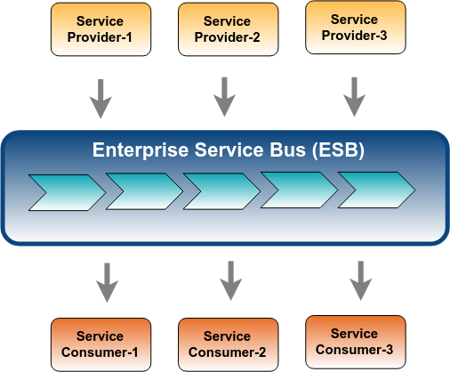

# Message Queue

> ## What is a message queue?
Message queue helps us to do _asynchronous processing_ eg. to transfer SMS, Mail, process requests, or pass information between services. This type of background processing is not commonly solved by RDBMS and we use a services queue to solve these efficiently known as a message queue.

---

> ## Why message queue is used?
With a message queue, We can efficiently maintain a significantly larger amount of simultaneous messages. Message queues can be used to **decouple** heavyweight processing. Messages are pushed in **real-time** instead of periodically listed, messages are automatically erased after being received and we do not need to bother about any _deadlocks_ or _race conditions_. Code is **scalable** without any worry due to decoupling. In short, message queues present a fundamentally sound strategy for managing massive asynchronous processing.

---

> ## What are popular tools?
- Kafka
- RabbitMQ
- Amazon SQS
- Celery
- ActiveMQ
- IBM MQ
- Azure Service Bus
- CloudAMPQ
- Amazon MQ
---
  
> ## What is an enterprise message bus?
An enterprise message bus or enterprise service bus (ESB) is a software architecture model that enables interaction between several applications. Instead of communicating with each other, all applications communicate with the enterprise service bus, which controls modifying and routing the messages to their suitable targets.

An ESB gives its primary services through an event-driven and standards-based messaging engine (the bus). Enterprise message bus integration architects can utilize the value of messaging without writing code. The enterprise message bus is a collection of enterprise architecture design models that are currently implemented by many enterprise software products.

---

> ### References
- [cloudamqp.com what-is-message-queuing](https://www.cloudamqp.com/blog/2014-12-03-what-is-message-queuing.html)
- [medium.com when-should-i-use-message-queue](https://medium.com/@mena.meseha/when-should-i-use-message-queue-f96f39159c8f)
- [medium.com what-do-you-really-need-within-your-integration-solution-esb](https://medium.com/@jagathsisira/what-do-you-really-need-within-your-integration-solution-esb-or-microservices-1552d9803cb4)
- [https://www.youtube.com/watch?v=r5byURobuaQ](https://www.youtube.com/watch?v=r5byURobuaQ)
- [https://www.youtube.com/watch?v=5-Rq4-PZlew](https://www.youtube.com/watch?v=5-Rq4-PZlew)
- [https://www.youtube.com/watch?v=W4_aGb_MOls](https://www.youtube.com/watch?v=W4_aGb_MOls)